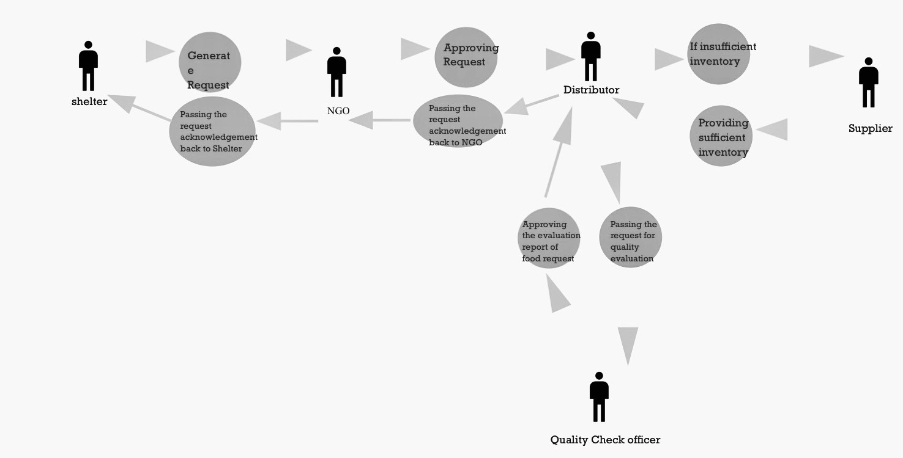
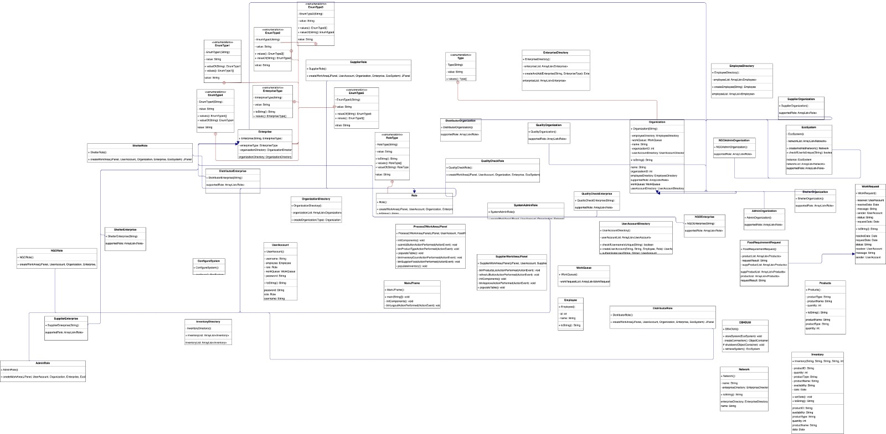

NGO Management System Problem Statement: In order to improve the proper utilization of the various distributive services offered by various enterprises and subsequently design a system for solving the major crises problems faced by the shelter enterprises, we aim to build an NGO management solution system using software engineering techniques. The NGO Management solution will allow the shelter to send multiple requests to the NGO, and the NGO will only approve requests before sending them to other businesses, such as distributors, who will then send them to quality check for the provided item stock. In this way, the supplies are delivered to the shelter enterprise without compromising the quality of the supplies. Our ultimate goal is to create an NGO management solution system that will generate requests from various shelters in various cities and, in accordance with the appropriate levels of authorization and quality check services, approve the primary request and subsequently cause the quality-checked items to be delivered to various shelters in the appropriate manner. 

Enterprises:
NGO
Shelter
Distributor
Quality Check

Supplier Organizations:
Save The Children (NGO)
Boston Homeless Shelter (Shelter)
New York Homeless Shelter (Shelter)
Amazon (Distributor)
ISI (Quality Check)

PNG (Supplier) Roles:
System Admin
NGO Admin
NGO Officer
Shelter Admin
Shelter Officer
Distributor Admin
Distributor Officer
Supplier Admin
Supplier Officer
Quality Check Admin

Quality Check Officer Class Diagram: Object/Component Diagram: Use Case Diagram:

